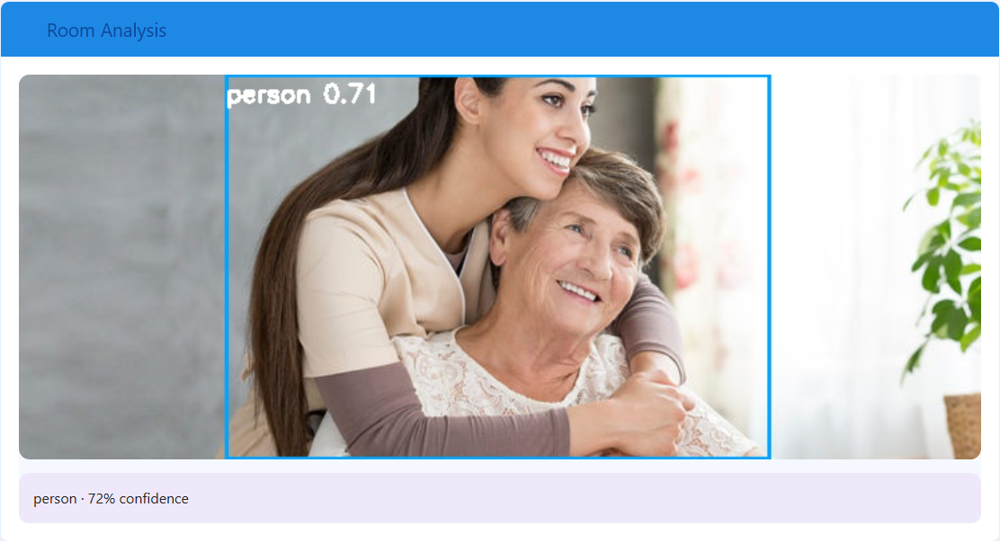
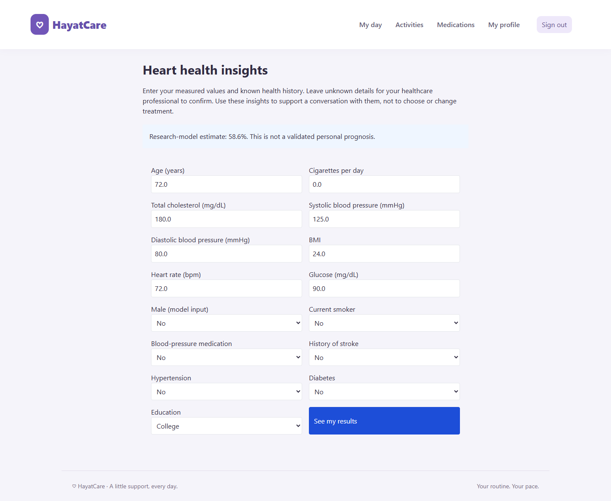

# HayatCare in pictures

Screenshots captured from the running application using a separate demo account.
The medication example is illustrative. No personal patient records are shown.

## Welcome & sign-in

## Daily care

## Brain activities

## Personal progress

The new demo account shows the starting view; performance history builds as activities are completed.

## Medication program

## Mobile view

## YOLO deep-learning detection

The image below shows **YOLOv8n running through HayatCare's upload-and-analyze flow**.
The input is an existing demonstration image in the project, not a patient upload.
Boxes and confidence scores come from the model's actual predictions, using a
confidence threshold above 50%. The pretrained model recognizes object classes;
these labels are not a complete home-safety assessment.

[View the detected classes, bounding boxes, and confidence scores](screenshots/yolo-results.json).

## Supervised ML example

The cardiovascular pipeline was run with illustrative measurements entered through
the app. This screenshot shows the model's actual output for those demo inputs,
not a real person's health assessment.

## Automated tests

**49 tests passed**, including a real YOLO upload-and-inference test. The image below renders the captured output of the Python test runner.
Coverage includes activity scoring, personal progress, medication schedules, reminders,
phone motion events, authentication, and account isolation.

[Read the original text output](screenshots/test-results.txt).
