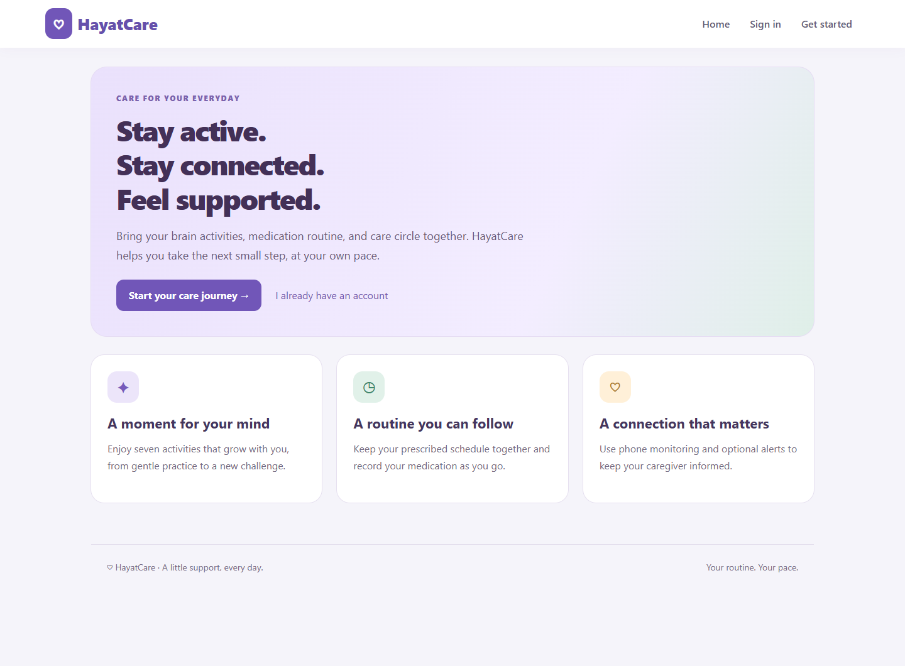
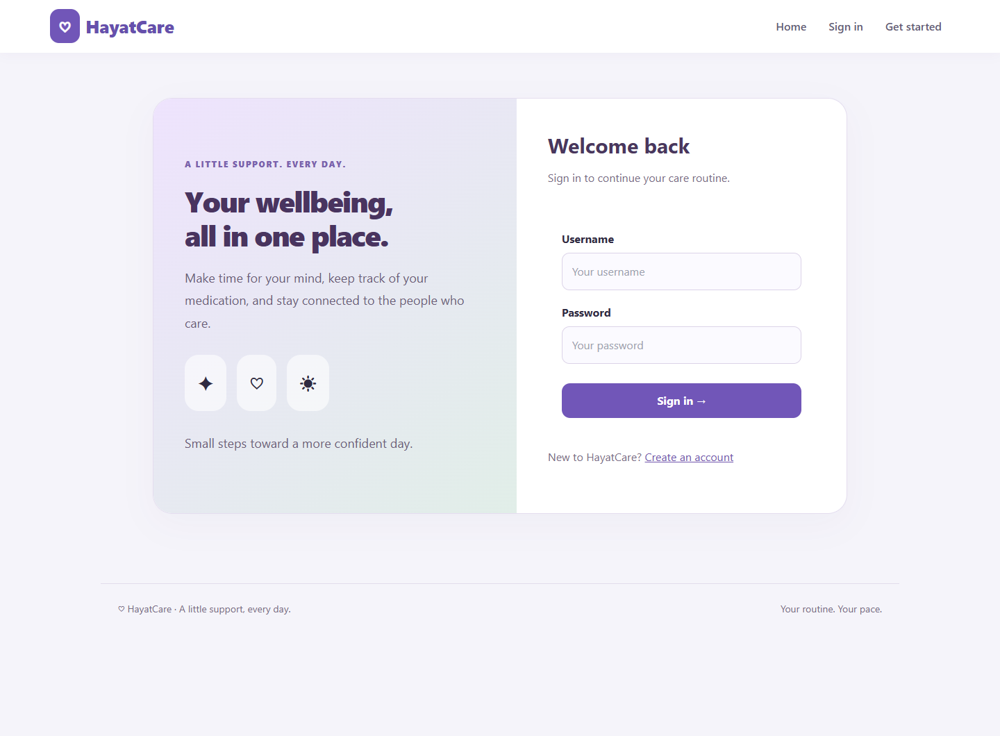
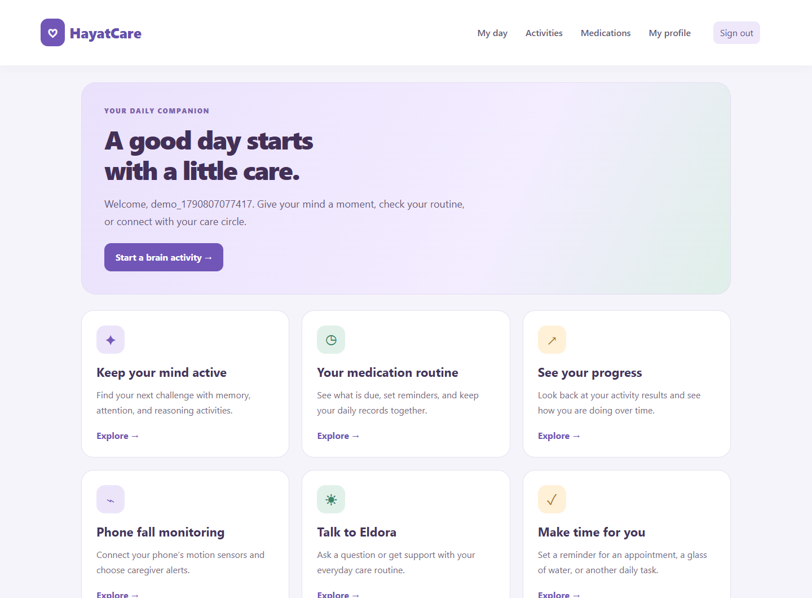
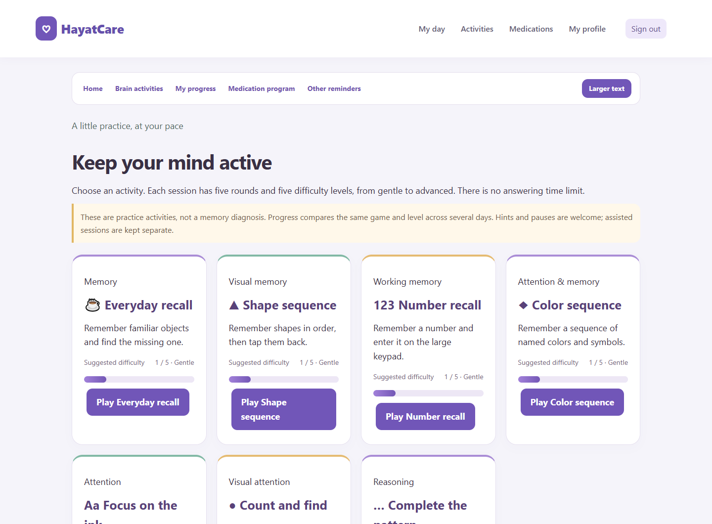
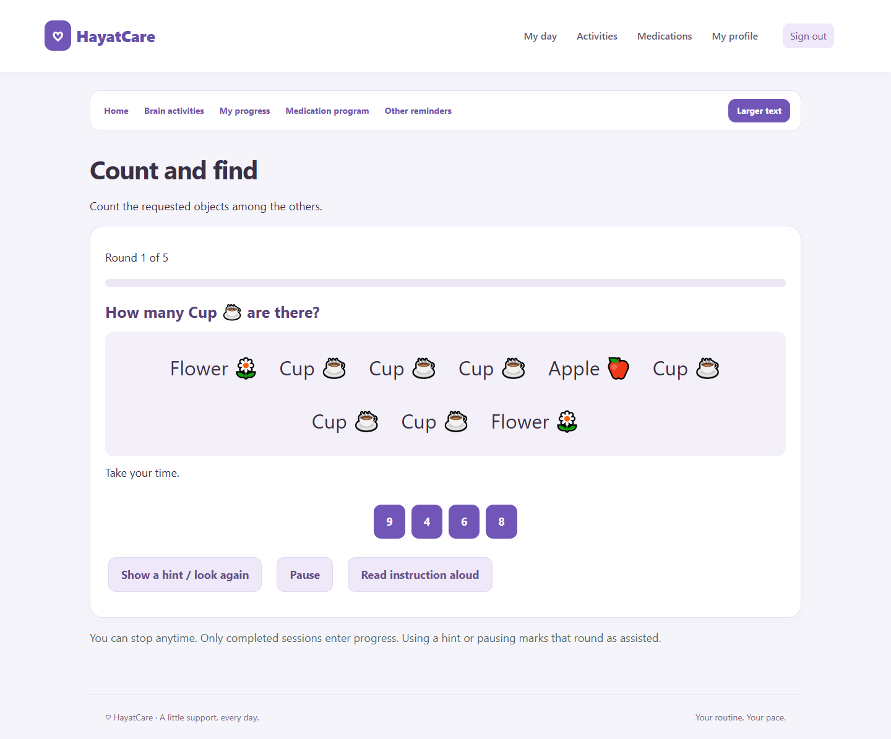
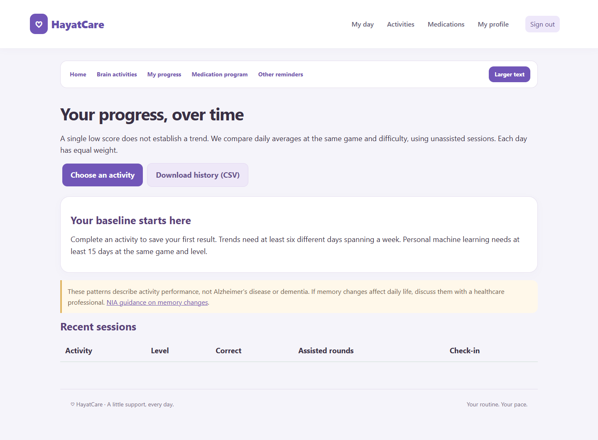
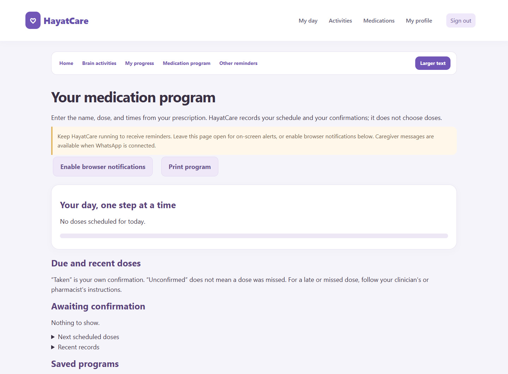
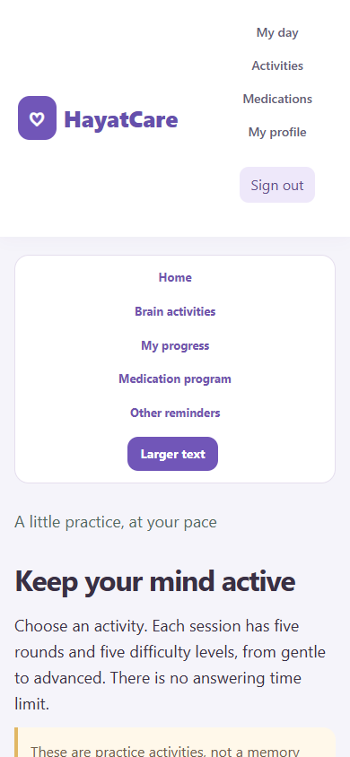
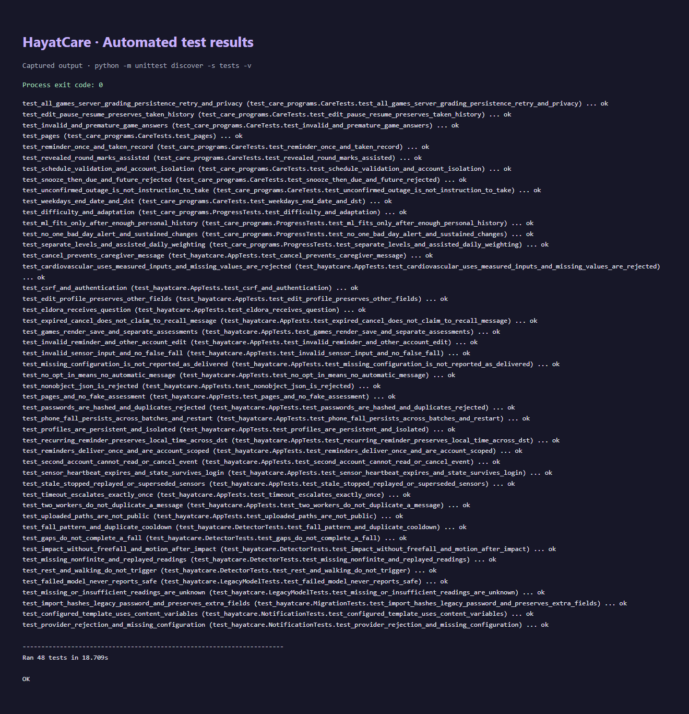

# HayatCare in pictures

Screenshots captured from the running application using a separate demo account.
The medication example is illustrative. No personal patient records are shown.

## Welcome & sign-in

## Daily care

## Brain activities

## Personal progress

The new demo account shows the starting view; performance history builds as activities are completed.

## Medication program

## Mobile view

## Automated tests

**48 tests passed.** The image below renders the captured output of the Python test runner.
Coverage includes activity scoring, personal progress, medication schedules, reminders,
phone motion events, authentication, and account isolation.

[Read the original text output](screenshots/test-results.txt).
